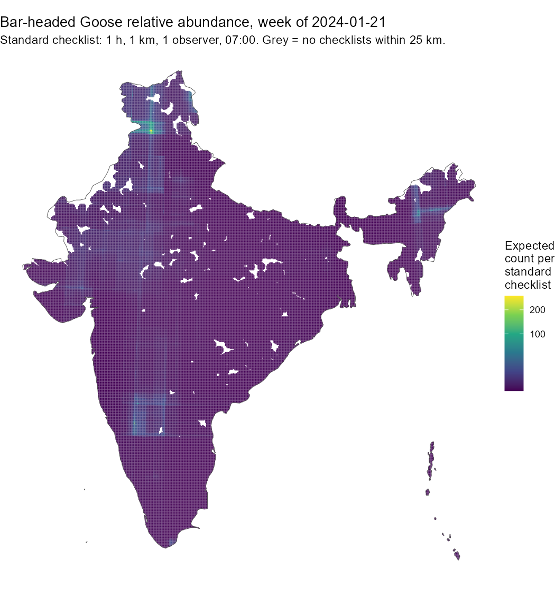
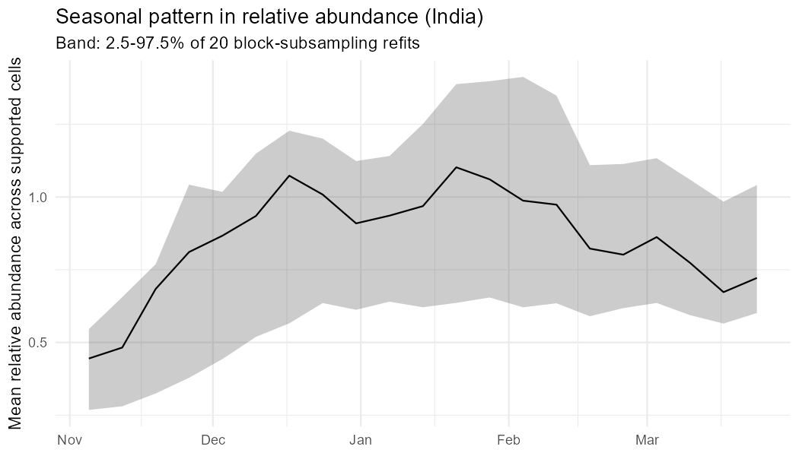

# Bar-headed Goose relative abundance in India from eBird (pilot)

An open, reproducible R workflow that estimates **relative abundance** of the Bar-headed Goose (*Anser indicus*) across India in winter (November to March) from eBird checklists alone.

> **What the output is:** the expected number of geese a birder would record on one *standardised* checklist (1 hour, 1 km, 1 observer, starting 07:00) in each 5 km cell, for each week of winter. It is a relative index for comparing places and weeks. It is **not** a population size and it is not comparable with national totals.
It is a starting point for work on combining eBird with acoustic monitoring data.

## Data (not included)

The workflow uses the eBird Basic Dataset (EBD), India, November 2015 to November 2025, with its sampling-event file. eBird data may not be redistributed, so **no raw data or checklist-level files are in this repository**. To reproduce the results, request the data from [ebird.org/data/download](https://ebird.org/data/download) and set the two file paths at the top of the script.

Citation: eBird Basic Dataset. Version: EBD_relOct-2025. Cornell Lab of Ornithology, Ithaca, New York. October 2025.

## What the script does

1. **Read and filter checklists.** India, November to March, complete checklists, Traveling or Stationary protocols, at most 5 h, 5 km and 10 observers. Stationary checklists are kept with distance set to 0.
2. **Remove duplicates.** Shared (group) checklists are copies of a single event, so one copy per group is kept.
3. **Zero-fill.** Checklists without a goose record become non-detections. Checklists with only "X" (present, no count) are detections with an unknown count.
4. **Thin the data.** One checklist per 5 km cell per week per year, chosen at random, to reduce the bias from heavily birded places.
5. **Encounter-rate model.** A random forest estimates the probability of recording the species. Out-of-bag predictions are then used to calibrate the probabilities with a smooth logistic curve.
6. **Count model.** A second random forest estimates the expected count when the species is present (flock sizes capped at the 99th percentile).
7. **Relative abundance = encounter rate x expected count**, predicted for a standardised checklist in every 5 km cell that has at least one checklist within 25 km, for each week of winter 2023-24.
8. **Validation** on held-out checklists, in two ways: random hold-out and spatial-block hold-out (100 km blocks).
9. **Uncertainty:** 20 refits of both models, each using a random 80% of the spatial blocks.

## Results

**Data:** 1,202,040 checklists after filters; 17,004 detections (1.41%); 986 detections with "X" counts. After thinning: 335,363 checklists with 7,167 detections.

| Validation | Encounter-rate AUC | Brier skill | Count given presence (Spearman) | Relative abundance vs observed count (Spearman) |
|---|---|---|---|---|
| Random hold-out (interpolation) | 0.934 | 0.275 | 0.414 | 0.197 |
| Spatial-block hold-out (new regions) | 0.882 | 0.033 | 0.082 | 0.145 |

Full tables, including calibration, are in [`outputs/validation.txt`](outputs/validation.txt).

- **Gap-filling works.** Under random hold-out, predicted encounter rates match observed rates across the full range.
- **Extrapolation does not.** In held-out regions, encounter rates are over-predicted at high probabilities (for example predicted 0.54, observed 0.32) and the count model has almost no skill.
- **Hotspots.** The highest cells are around 76.0°E, 32.07°N (the Pong Dam area, Himachal Pradesh) and 75.5°E, 15.1°N (north Karnataka); see [`outputs/top50_cells_peak_week.csv`](outputs/top50_cells_peak_week.csv).
- **Seasonal pattern.** Relative abundance rises through November, peaks from late December to late January, and declines through March ([`figures/seasonal_curve.png`](figures/seasonal_curve.png)).




## Limitations

- **No habitat information.** The model uses location, date, effort and observer experience only, so it learns where goose records are, not where goose habitat is. It interpolates well where checklists exist and should not be used for regions without them.
- **Map artefacts.** Splitting on raw latitude and longitude produces faint vertical and horizontal streaks. The hotspots are credible; the low-level pattern between them is not.
- **Partial uncertainty.** The band reflects which regions were sampled (80% block subsampling). It is not a full confidence interval.
- **Unknown counts excluded.** "X" counts are left out of the count model (986 of 17,004 detections).
- **One season, one species.** Predictions are for winter 2023-24 and for the Bar-headed Goose only.
- **Standard-checklist unit.** Values are expected geese per standard checklist, not per area, and not a population.

## How to run

```r
setwd("path/to/your/project")      # folder containing the script and, if you wish, the data
source("bahgoo_relative_abundance.R")                  # full run, about 50 minutes
Sys.setenv(QUICK = "1"); source("bahgoo_relative_abundance.R")   # quick test, a few minutes
```

Quick mode uses a subsample, fewer trees and fewer refits. It checks that the script runs, and its results should not be interpreted. Quick runs overwrite the `outputs/` folder.

R packages: `data.table`, `lubridate`, `ranger`, `mgcv`, `pROC`, `sf`, `rnaturalearth`, `ggplot2`. Tested with R 4.3.0.

## Files

| File | Content |
|---|---|
| `bahgoo_relative_abundance.R` | The full workflow |
| `figures/map_peak_week.png` | Map of relative abundance for the peak week |
| `figures/seasonal_curve.png` | Seasonal curve with the 80%-block-subsampling band |
| `outputs/validation.txt` | Validation metrics and calibration tables |
| `outputs/seasonal_curve*.csv` | Weekly mean relative abundance, with and without the band |
| `outputs/top50_cells_peak_week.csv` | The 50 highest-value cells in the peak week |
| `outputs/relative_abundance_peak_week.csv.gz` | Relative abundance for every supported 5 km cell in the peak week (derived, no checklist data) |

## Author

Suhridam Roy. PhD

prepared with the help of Claude


